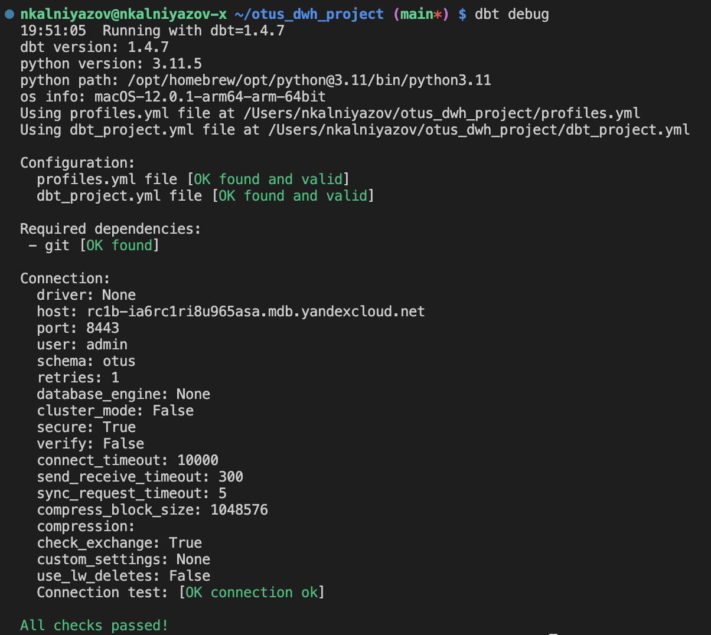
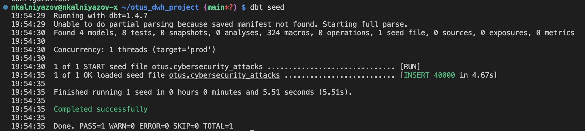
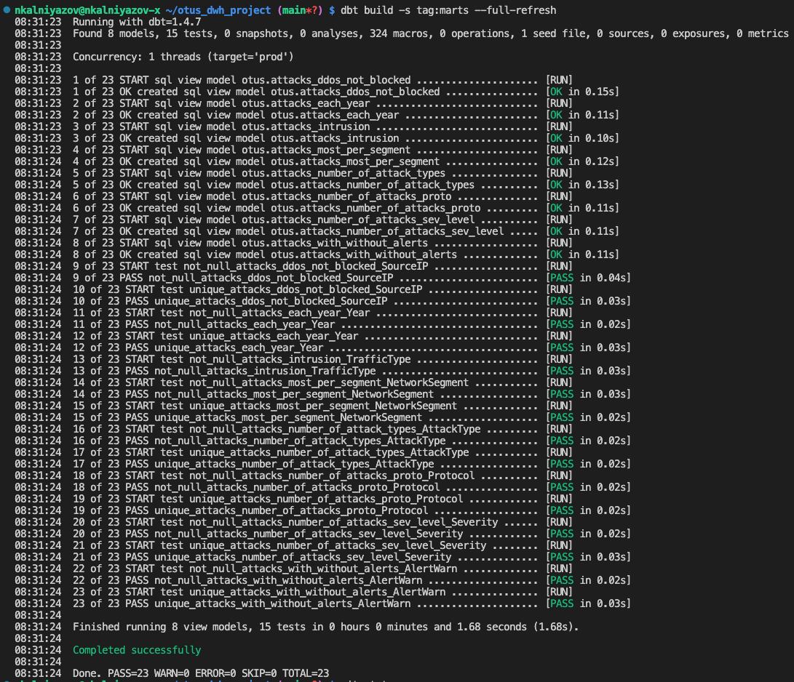
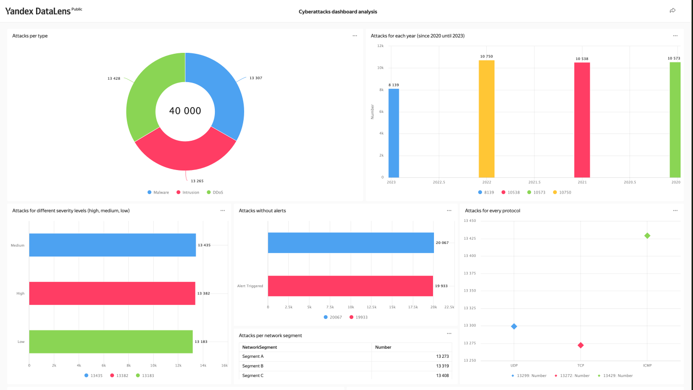

# Otus DWH project
## [The source ot the dataset](https://www.kaggle.com/datasets/teamincribo/cyber-security-attacks)
## Prerequisites

- Install dbt
- Install terraform

## Assignment
1. Add enviroment variables with clickhouse user:
   
   ```bash
    cd terraform/
    cp ../.env.template .env 
    ```

2. Set environment variables:

    ```bash
    export YC_TOKEN=$(yc iam create-token)
    export YC_CLOUD_ID=$(yc config get cloud-id)
    export YC_FOLDER_ID=$(yc config get folder-id)
    export $(xargs <.env)
    ```

3. Deploy using Terraform

    ```bash
    terraform init
    terraform validate
    terraform fmt
    terraform plan
    terraform apply
    ```

4. Store terraform output values as environment variables:

    ```bash
    export CLICKHOUSE_HOST=$(terraform output -raw clickhouse_host_fqdn)
    export DBT_HOST=${CLICKHOUSE_HOST}
    export DBT_USER=${CLICKHOUSE_USER}
    export DBT_PASSWORD=${TF_VAR_clickhouse_password}
    ```

5. Make sure dbt can connect to your target database:
    
    ```bash
    dbt debug
    ```



6. Load csv file to my target database:
    
    ```bash
    dbt seed
    ```



7. Build marts:
    ```bash
    dbt build -s tag:marts --full-refresh
    ```




## [Cyberattacks dashboard analysis in datalens](https://datalens.yandex/l0ad2z232rv8a)

